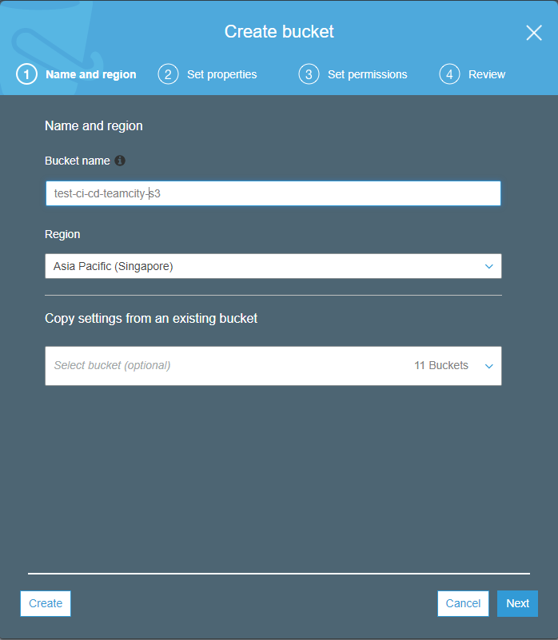
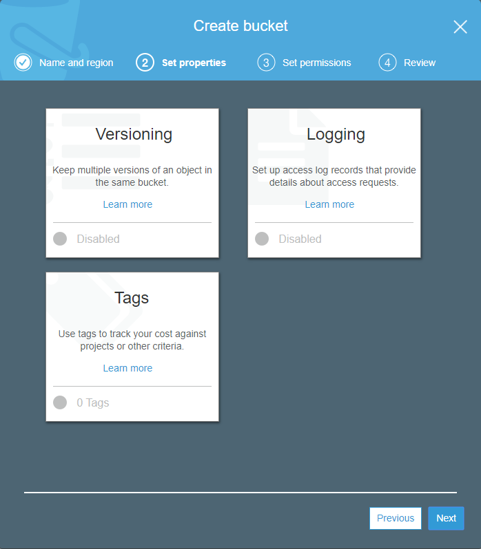
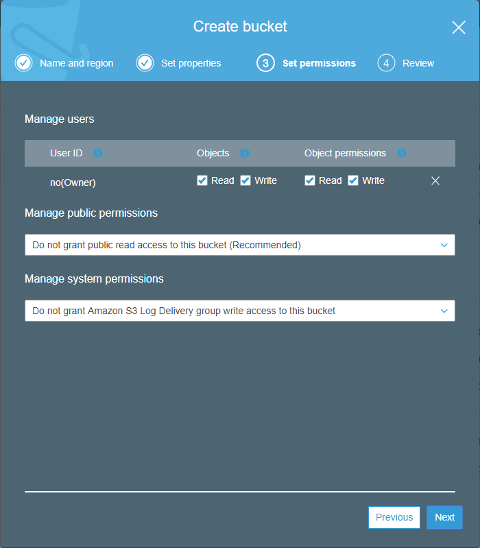
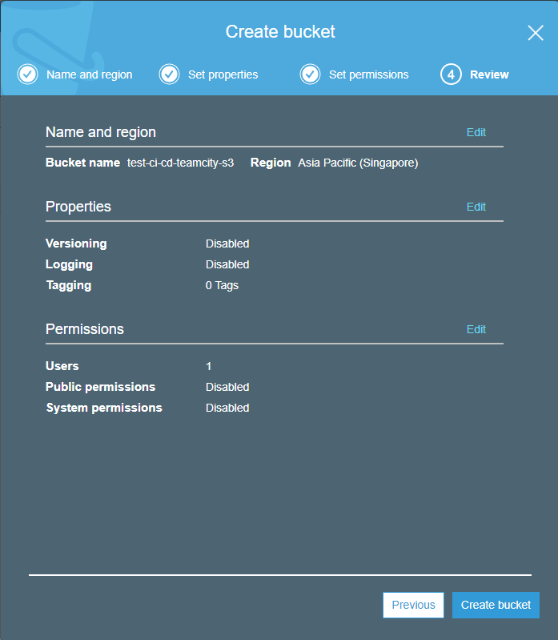

# Continous Integration and Continous Delivery Rails application into Amazon Cloud.
*OS*: CentOS 7

*Tools*: TeamCity, AWS CodeDeploy, Ansible

*Environments*: Test, Production 

## Description
This article is not about why we have choosen these kind of tools.
The aim of this article is to share my experience. 

## What do we have?
1. Rails app repository - github.com. Detailed information -https://github.com
2. AWS account - existed. Detailed information - https://aws.amazon.com
3. TeamCity - installed. Detailed information - https://www.jetbrains.com/teamcity

## How it works


## Configuring AWS
### Configuring IAM
#### Creating new Roles
#### Creating new User for Teamcity
##### Step 1
http://docs.aws.amazon.com/IAM/latest/UserGuide/id_users_create.html
##### Step 2
For Teamcity configuration we need to have Access key. Let's create it. **Do not forget to copy it!**

http://docs.aws.amazon.com/IAM/latest/UserGuide/id_credentials_access-keys.html

### Configuring S3
#### Step 1



#### Step 2



#### Step 3



#### Step 4



#### Step 5

Let's grant permissions to user under which Temacity will work with Amazon to put application versions to bucket.
Got to Bucket -> Permissions -> Bucket Policy and add to Bucket policy editor this json:
```json
{
    "Version": "2012-10-17",
    "Statement": [
        {
            "Effect": "Allow",
            "Principal": {
                "AWS": "arn:aws:iam::470578543754:user/_your_teamcity_user"
            },
            "Action": [
                "s3:GetBucketWebsite",
                "s3:GetLifecycleConfiguration",
                "s3:GetObject",
                "s3:GetObjectAcl",
                "s3:GetObjectTagging",
                "s3:GetObjectTorrent",
                "s3:GetObjectVersion",
                "s3:GetObjectVersionAcl",
                "s3:GetObjectVersionTagging",
                "s3:GetObjectVersionTorrent",
                "s3:GetReplicationConfiguration",
                "s3:ListBucket",
                "s3:ListBucketMultipartUploads",
                "s3:ListBucketVersions",
                "s3:ListMultipartUploadParts",
                "s3:PutObject",
                "s3:PutObjectTagging",
                "s3:PutObjectVersionAcl",
                "s3:PutObjectVersionTagging"
            ],
            "Resource": [
                "arn:aws:s3:::_your_s3_basket_name/*",
                "arn:aws:s3:::_your_s3_basket_name"
            ]
        }
    ]
}
```
### Configuring CodeDeploy

