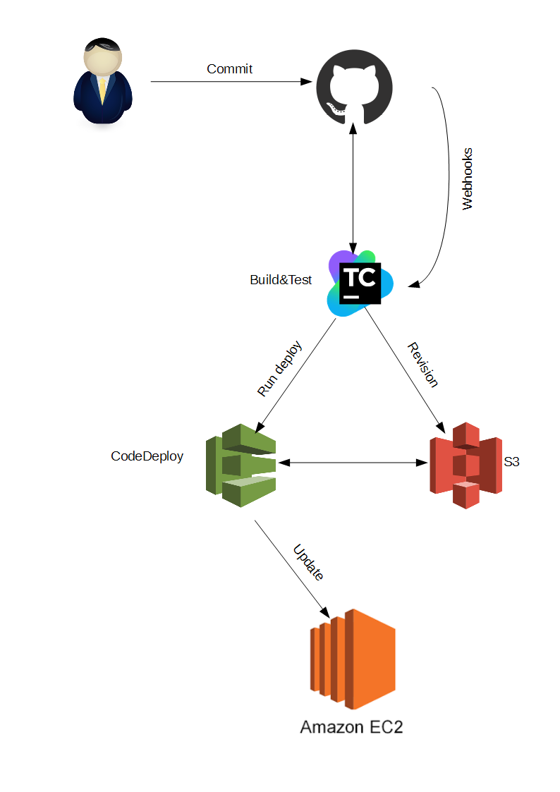

# Continous Integration and Continous Delivery Rails application into Amazon Cloud.
*OS*: CentOS 7

*Tools*: TeamCity, AWS CodeDeploy, Ansible

*Environments*: Test, Production 

## Description
This article is not about why we have choosen these kind of tools.
The aim of this article is to share my experience. 

## What do we have?
1. Rails app repository - github.com. Detailed information -https://github.com
2. AWS account - existed. Detailed information - https://aws.amazon.com
3. TeamCity - installed. Detailed information - https://www.jetbrains.com/teamcity

## How it works

