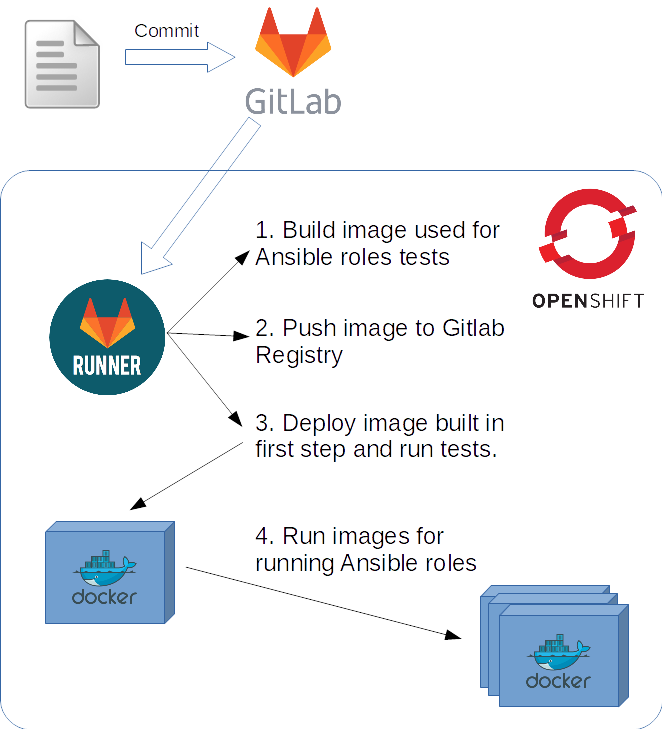

# Testing Ansible's roles

## Description
Our infrastracture for CI is:
1. [Gitlab](https://about.gitlab.com)
2. [OpenShift Origin](https://www.openshift.org/)

We will configure [Gitlab runner](https://docs.gitlab.com/runner/install/kubernetes.html) to test ansible roles with [molecule](https://molecule.readthedocs.io). If you don't know [molecule](https://molecule.readthedocs.io) please read documentation [there](https://molecule.readthedocs.io).  
[Molecule](https://molecule.readthedocs.io) is able to use Docker for testing Ansible roles and that's what we needed.  

## Pipeline

## Set everything up

### Openshift

#### Create new project 

Openshift Web Console -> New project

Upload new Template

Openshift Web Console -> Gitlab-ci -> Add to Project -> Import YAML/JSON

Insert template:

`oc adm policy add-scc-to-user privileged <user>`
